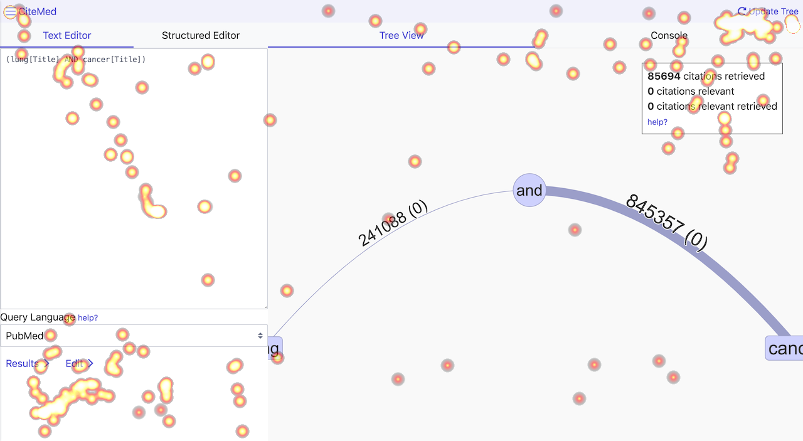

# Big Brother

_bigbro_ is a website interaction logging service. 

## Client

To use _bigbro_ on a website, include the following Javascript snippet (this repository hosts `bigbro.js` in the [js folder](js)):

```html
<script type="text/javascript" src="bigbro.js"></script>
<script type="text/javascript">
    BigBro.init("username", "localhost:1984");
</script>
```

This will allow the page to capture most events that occur by interacting with the page.

Custom logging events can also be added, see the following example:

```html
<script type="text/javascript" src="bigbro.js"></script>
<script type="text/javascript">
    let bb = BigBro.init("username", "localhost:1984");
    window.addEventListener("click", function (e) {
        bb.log(e, "custom_event");
    })
</script>
```

The arguments to `BigBro.init` are as follows:

 - `actor`: A unique identifier of the current user.
 - `server`: The address _bigbro_ is running on (please omit protocol; this will be determined automatically).
 - (optional) `events`: A list of events that will be listened on globally (at the window level); e.g. "click", "mousemove".

## Server

_bigbro_ is written in Go. To install locally, please use:

```bash
go install github.com/hscells/bigbro/cmd/bigbro
```

Alternatively, download a [prebuilt binary](https://github.com/hscells/bigbro/releases).

_bigbro_ will save events as they occur into a file called `bigbro_%timestamp.log`. This file is located in the directory `bigbro` is run in.

Events are sent via websockets.

## Tools

To perform analysis, one may create heatmaps with the _bbheat_ tool. To install this tool, use:

```bash
go install github.com/hscells/bigbro/cmd/bbheat
```

For help with this tool, run:

```bash
bbheat --help
```

```bash
Usage: bbheat --log LOG --heatmap HEATMAP [--image IMAGE] [--start START] [--end END] [--interval INTERVAL] [--location LOCATION] [--actor ACTOR] [--method METHOD] [--width WIDTH] [--height HEIGHT]

Options:
  --log LOG              path to log file produced by bigbro
  --heatmap HEATMAP      path to output heatmap to
  --image IMAGE          path to image file for analysis
  --start START          time to start analysis
  --end END              time to end analysis
  --interval INTERVAL    create an animation every n seconds
  --location LOCATION    URL to limit analysis (regex)
  --actor ACTOR          actor to limit analysis
  --method METHOD        method to limit analysis
  --width WIDTH          width to limit analysis
  --height HEIGHT        height to limit analysis
  --help, -h             display this help and exit
  --version              display version and exit
```



_bbheat_ can create both static heatmaps and animations. The image format accepted for input is png. The output format
of static heatmaps is png. The output format of animations is gif. To make a gif use the `interval` argument to specify
how many seconds must pass the log for a new heatmap to be made. The start time, end time, actor, location, and method
can be specified to limit aspects of the log used in the heatmap. The location accepts a regular expression. To
overlay the heatmap over an image, use the `image` option. This image must be a png. To create a heatmap, the screen
width and height must be the same. If there are multiple screen sizes in the log, limit this with the `width` and 
`height` arguments.